## Guia básico dos meus aprendizados com o JavaScript.

O JavaScript(JS) é uma linguagem de programação dinâmica que nos fornece diversas funcionalidades, juntamente com o HTML e CSS.
No editor de códigos de sua preferência (irei usar como base o Visual Studio Code), você irá conseguir utilizar o JS de 2 maneiras:

**1ª**- No arquivo _index.html_, basta criar dentro da tag _body_, uma tag _script_, dessa maneira:
```javascript
<body>
    <script>
        // código vai aqui!
    </script>
</body>
```
**2ª**- Também no arquivo _index.html_, utilizar um link dentro do _head_ direcionado à um novo
arquivo _script.js_, e lá inserindo seus comandos em JavaScript, deixando o código mais organizado e limpo (sendo a maneira mais indicada), por exemplo:
```javascript
<head>
    <script src="script.js"></script>
</head>
```

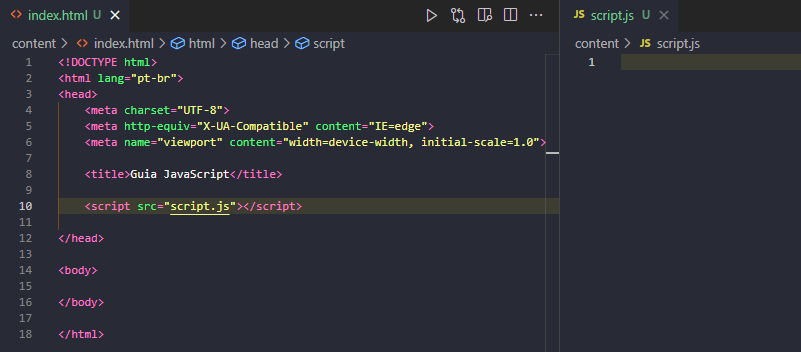

> Atalho: Ctrl + click -> clicando no _script.js_, automaticamente irá criar o tipo de arquivo escrito.

---

## `Console`
O console é uma ferramenta existente tanto no navegador quanto no editor de código, que nos exibe informações, erros e é bastante utilizada para testes.

Em falar em console, devemos falar também do _log_, um método que é usado para exibir mensagens. Para isso, copie o caminho do seu arquivo _index.html_ e cole no navegador de sua preferência.

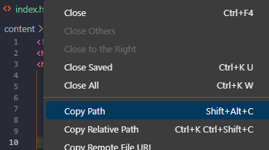

Agora, aperte F12 para abrir o DevTools. E vamos inserir uma mensagem na 1ª linha do _script.js_ para ver se ambos arquivos estão conectados corretamente:

```javascript
console.log('testando...')
```

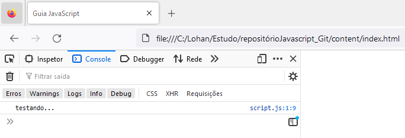

Como podemos ver, o teste retornou certinho.

# Variáveis

Existem 3 tipos de variáveis para a declaração de atribuições no JS. Sendo elas: **var**, **let** e **const**. E para tratarmos desse assunto, devemos falar do _ESCOPO_, que se refere a visibilidade e acessibilidade de variáveis e outros...<br>O escopo define as áreas onde essas entidades são válidas.

### - Escopo Global
É o mais amplo, variáveis declaradas no global são visíveis em todo o código (somente _var_ é também visível no global do navegador).<br>Como exemplo vamos declarar uma variável:

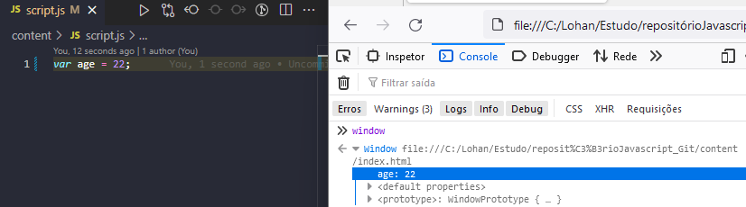

Ao abrir o console e digitarmos _window_, podemos ver que o _age = 22_ está lá!

---

### - Escopo Local
Se refere à um escopo delimitado dentro de uma função, variáveis criadas dentro delas não podem ser acessadas fora desse escopo. O que permite a criação de variáveis com o mesmo nome!

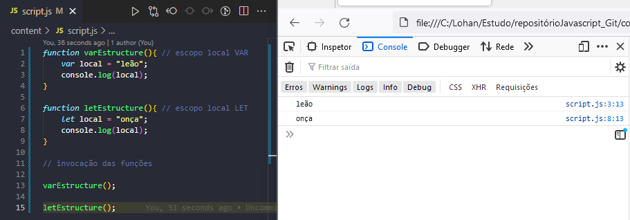

Agora vamos tentar chamar a variável de fora da _function:_

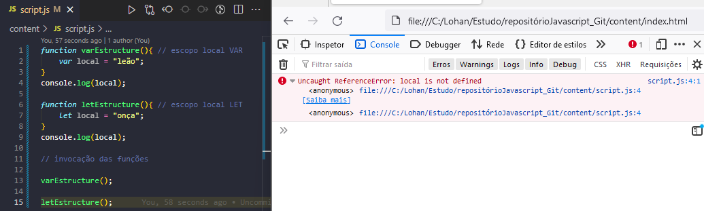

Percebemos no aviso de erro que a variável aparece como não definida, pois não é possível acessá-los em ambos (_let_ ou _var_) os casos.

---

### - Escopo em Bloco
É caracterizado quando o pedaço de código está entre chaves `{}`, seja num _else_, num _do_ etc. Vejamos:

> _PS:_ Por algum motivo o JS aceita códigos somente entre chaves.

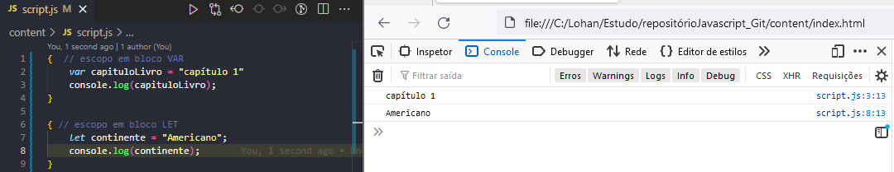

Agora vamos tentar chamar essas variáveis de fora da função...

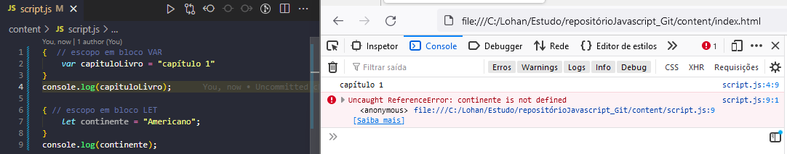

O _let_ é limitado a ser chamado somente dentro do bloco, já o _var_ é acessível fora dele, pois são içadas (_hoisting_) para o topo do escopo externo do bloco, veremos mais detalhes na descrição da palavra-chave _VAR_ abaixo.

* _LET:_ Tem escopo global _(do arquivo js)_, local e em bloco.<br>- Não são visíveis fora do bloco, podendo ser referenciadas somente dentro dele.<br>- Não são içadas para o topo do escopo onde foram declaradas, podendo ser acessadas somente depois de sua declaração.

---

* _VAR:_ Tem escopo global e local.<br>- Não são limitadas por blocos, podendo ser visiveis em todo o escopo da função em que se encontra ou no objeto global.<br> - São içadas para o topo do escopo onde foram declaradas, tornando a declaração _undefined_, consequentemente, não movendo sua atribuição.

---

* _CONST:_ Escopo global _(do arquivo .js)_, local e em bloco.<br>- Depois de declarada sua atribuição, não é permitido a alteração da mesma, por isso o nome.<br>- Compartilha o comportamento do _let_, também não são içadas para o topo do escopo.

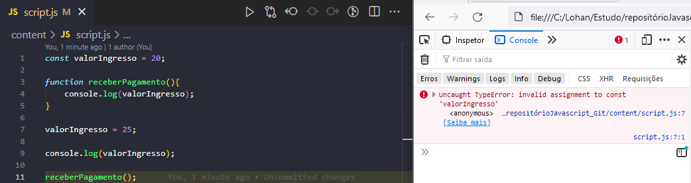

> _PS:_ Ao tentar redeclarar o valor da const, o console nos envia um erro.

# Tipos de Dados

Na versão atual, existem sete tipos de dados, eles são:
### - String
```javascript
let username = 'JuninhoDaRua12';
```
O retorno dessa variável será do tipo _string_, nela podem haver caracteres especiais, números, letras, espaços e pontuações.

---

### - Boolean
```javascript
let luzDoQuarto = false;
```
Nesse tipo, temos ou _true_ ou _false_.

---

### - Number
```javascript
let idade = 22;
```
Tipo que armazena números apenas.

---

### - undefined
```javascript
    let receberPagamento ;
    console.log(receberPagamento);
> undefined
```
ou
```javascript
    console.log(receberPagamento);
    var receberPagamento = 100;
> undefined
```
> _PS:_ Esse segundo caso acontece pelo _hoisting._

O tipo _undefined_ é quando não temos um valor atribuído à variável.

---

### - null
```javascript
let primeiraInscricao = null;
```
No tipo _null_ existe um valor 'vazio' na variável. Diferente do _undefined_, que não há valor algum definido.

# Operadores

Operadores são símbolos que executam uma operação matemática ou lógica. Para esse módulo, iremos utilizar a extensão **_Live Preview,_** para utilizarmos o console do navegador sem precisarmos recarregá-lo manualmente.

## Precedência de operações

Numa operação matemática onde existem muitas operações, é seguido uma sequência:<br>1° _entre parênteses_ `()`<br>2° _exponencial_ `**`<br>3° _multiplicação_ `*` e _divisão_ `/` (da esquerda pra direita).<br>4° _adição_ `+` e _subtração_ `-` (também da esquerda pra direita.)

---

## Autoatribuições
```javascript
let x = 10;

x -= 2; // 8 (subtrai)
x += 2; // 12 (adiciona)
x *= 2; // 20 (multiplica)
x /= 2; // 5 (divide)
x **= 2; // 100 (quadrado)
x %= 2; // 0 (resto int)
```

---

## Atalho
```javascript
let y = 50;

y++ > 50 // executa a conta, mas mostra somente depois
++y > 51 // executa e já mostra a conta
--y > 49 // executa e já mostra a conta
y-- > 50 // executa a conta, mas mostra somente depois
```
Veja os exemplos abaixo:

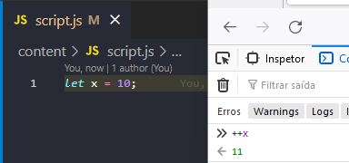

Vemos que o incremento foi calculado antes da impressão no console, pois o atalho foi colocado antes da variável.

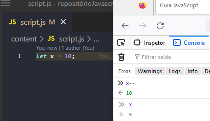

Nesse caso, foi preciso chamar a variável uma segunda vez para vermos o cálculo final do decremento.

---

## Operadores Relacionais
```javascript
> // maior
< // menor
== // igual
>= // maior ou igual
<= // menor ou igual
!= // diferente
```

---

## Operadores de Identidade
### - Igualdade estrita:
Além da comparação dos valores, existe a comparação do tipo.
```javascript
    console.log(5 === 5);
> true
    console.log(5 === '5');
> false
```
### - Igualdade solta:
Faz a comparação apenas dos valores declarados.
```javascript
    console.log(2023 == 2023);
> true
    console.log(2023 == '2023');
> true
```
Não sendo recomendado para utilização, pois não faz uma comparação integral de valores.
### - Desigualdade:
Verifica se os dois operandos não são iguais, retornando resultado booleano.<br>Não leva em conta tipos.
```javascript
    console.log(2023 != '2023');
> false
```
### - Desigualdade estrita:
Verifica se os dois operandos não são iguais, retornando resultado booleano.<br>Leva em conta tipos.
```javascript
    console.log(2023 !== '2023');
> true
```

---

## Ternário
Muito útil para fazer comparações e se livrar de tantos _if_ para isso, sendo mais eficiente.<br>Sua nomenclatura se dá assim: `teste ? true : false`, vejamos...
```javascript
    let média = 8.5;

    let aprovação = média >= 6 ? 'Aprovado' : 'Reprovado';
> Aprovado
```
Perceba que pelo fato da variável 'média' ser maior ou igual a 6, o resultado do teste é _true._

---

## Operadores Lógicos
### - `&&` (AND) Conjunção Binário

O resultado retorna `true` somente se ambos forem `true`.
```javascript
    let brasileiro = true;
    let maiorDeIdade = true;

    let vagaDeEmprego = brasileiro && maiorDeIdade;
> true
```
### - `||` (OR) Disjunção Binário

O resultado retorna `true` se um, ou os dois operandos forem `true`, sendo o único retorno como `false` quando ambos são `false`.<br>Vejamos:
```javascript
    let criança = false;
    let menosDe60kg = false;

    let entradaPulPula = criança || menosDe60kg;
> false
```
### - `!` (NOT) Negação Unário

Muda o valor que a expressão retornou.
```javascript
    let nome = "Joaquim";

    if(!(nome == "Iago")){
        console.log(nome);
    }
> Joaquim
```
No exemplo temos _'(nome == "Iago")'_ como `true` mas pelo fato de o `!` se encontrar na frente da expressão entre parênteses, o valor retornado é "Joaquim" (`false`).