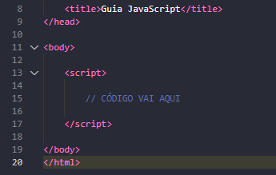
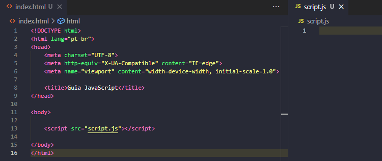

## Guia básico dos meus aprendizados com o JavaScript.

O JavaScript(JS) é uma linguagem de programação dinâmica que nos fornece diversas funcionalidades, juntamente com o HTML e CSS.
No editor de códigos de sua preferência (irei usar como base o Visual Studio Code), você irá conseguir utilizar o JS de 2 maneiras:

1ª- No arquivo .html, basta criar dentro da tag body, uma tag script, dessa maneira:
```javascript
<body>
    <script>
        código vai aqui!
    </script>
</body>
```
<!--  -->
<p></p>

2ª- Também no arquivo .html, utilizar um link dentro da tag body direcionado à um novo
arquivo .js, e lá inserindo seus comandos em JavaScript, deixando o código mais organizado
e limpo (sendo a maneira mais indicada), por exemplo:
```javascript
<body>
    <script src=".js"</script>
</body>
```
<!--  -->
<p></p>

> Atalho: Ctrl + click -> clicando no ".js", automaticamente irá criar o tipo de arquivo escrito.